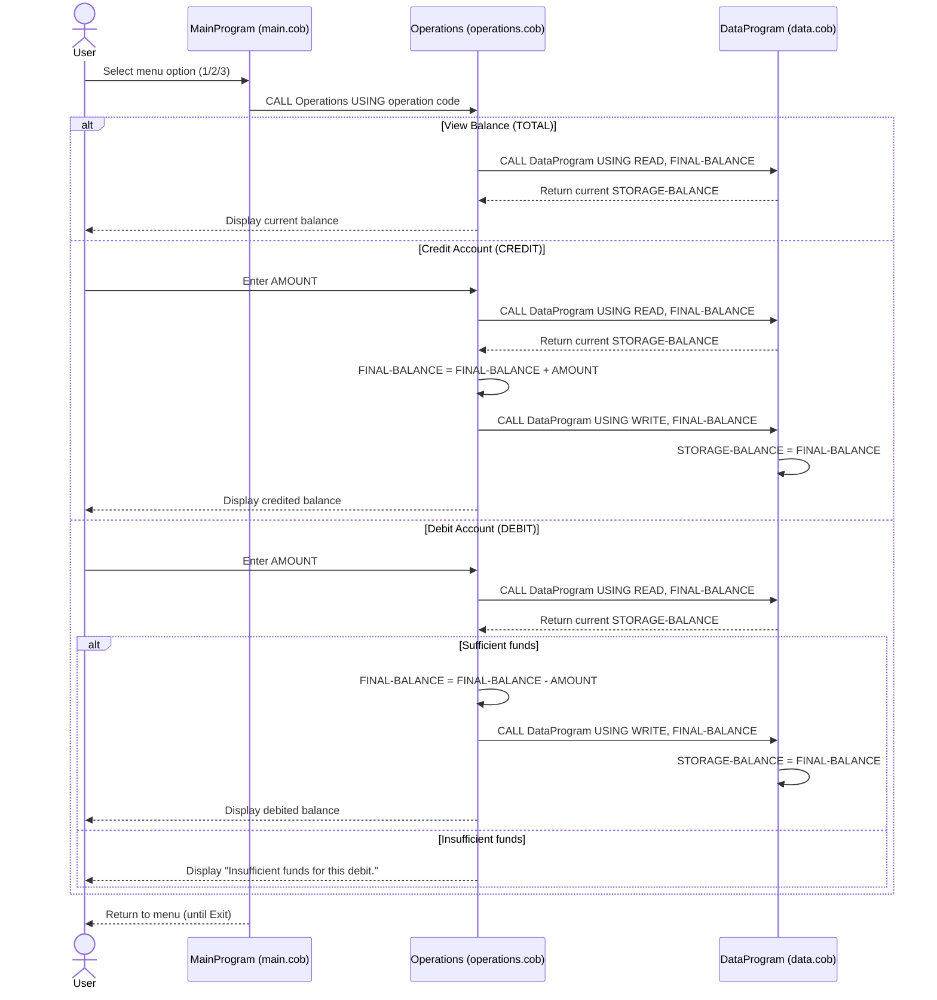

# COBOL Student Account System Documentation

This document describes the COBOL programs under [src/cobol](../src/cobol) and the business rules implemented for student account handling.

## Overview

The system is a menu-driven account manager that supports:
- Viewing account balance
- Crediting an account
- Debiting an account (with insufficient-funds protection)

The programs are split into:
- A UI/controller program
- A data access program
- A business operations program

## File Purposes

### [src/cobol/main.cob](../src/cobol/main.cob)
Program ID: `MainProgram`

Purpose:
- Entry point for the application.
- Displays a menu and accepts user choice.
- Routes user requests to the operations program.

Key logic:
- `PERFORM UNTIL CONTINUE-FLAG = 'NO'` loop keeps the app running.
- `EVALUATE USER-CHOICE` dispatches operations:
  - `1` -> `CALL 'Operations' USING 'TOTAL '`
  - `2` -> `CALL 'Operations' USING 'CREDIT'`
  - `3` -> `CALL 'Operations' USING 'DEBIT '`
  - `4` -> exit
- Handles invalid menu selection with a user-facing message.

### [src/cobol/operations.cob](../src/cobol/operations.cob)
Program ID: `Operations`

Purpose:
- Implements account business actions.
- Reads and updates account balance through `DataProgram`.

Key logic by operation type:
- `TOTAL `
  - Reads balance from `DataProgram` (`READ`).
  - Displays current balance.
- `CREDIT`
  - Accepts credit amount from user.
  - Reads current balance.
  - Adds amount to balance.
  - Writes updated balance via `DataProgram` (`WRITE`).
- `DEBIT `
  - Accepts debit amount from user.
  - Reads current balance.
  - Debits only if current balance is greater than or equal to requested amount.
  - Writes updated balance when allowed; otherwise displays insufficient funds message.

### [src/cobol/data.cob](../src/cobol/data.cob)
Program ID: `DataProgram`

Purpose:
- Provides simple data storage/retrieval for account balance.
- Acts as the data layer used by `Operations`.

Key logic:
- Stores balance in working storage (`STORAGE-BALANCE`), initialized to `1000.00`.
- Supports two operation codes via linkage parameter:
  - `READ` -> returns stored balance.
  - `WRITE` -> updates stored balance with provided value.

## Student Account Business Rules (Current Implementation)

1. Initial account balance is `1000.00`.
2. Balance is maintained centrally in `DataProgram` and accessed via `READ`/`WRITE` operations.
3. Credits always increase balance by the entered amount.
4. Debits are allowed only when `balance >= debit amount`.
5. If debit amount exceeds current balance, transaction is rejected and balance remains unchanged.
6. Operation routing is command-based with fixed 6-character codes (`TOTAL `, `CREDIT`, `DEBIT `).

## Notes and Constraints

- Amount and balance fields are defined as `PIC 9(6)V99` (up to 6 integer digits and 2 decimal digits).
- No explicit validation is currently implemented for:
  - Negative amounts
  - Zero-value transactions
  - Non-numeric input handling beyond COBOL runtime behavior
- Balance storage is in program working storage, so persistence depends on runtime/program lifecycle and environment setup.

## Sequence Diagram (Data Flow)

